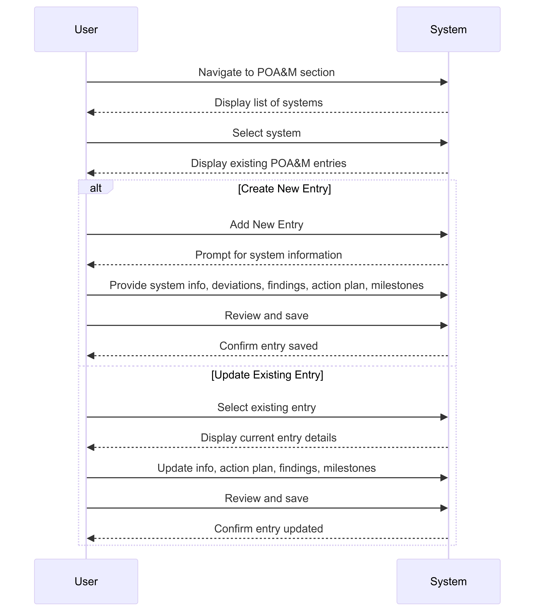

# FedRAMPFlow App Project 

## OSCAL

### Key Components of OSCAL
- Catalogs: Define security controls.
- Profiles: Tailor controls to specific needs.
- Component Definitions (CDEF): Supplier provided documentation describing how a component that is a building block of a larger information system can be used to implement controls.
- System Security Plans (SSP): Document how controls are implemented.
- Assessment Plans (SAP): Define how assessments are conducted.
- Assessment Results (SAR): Document the outcomes of assessments.
- Plan of Action and Milestones (POA&M): Track issues and remediation plans.


## SSP and POAM App 

### Purpose 

Application is designed to manage and track security compliance in accordance with FedRAMP requirements. It enables users to add new security system plan and handle Plan of Action and Milestones (POA&M) entries efficiently, and produce exports in OSCAL formats.

### System Security Plan:

- Users can navigate to the "Systems" section and add new systems by providing essential details such as CSP name, CSO name, FedRAMP package ID, service model (e.g., IaaS, PaaS, SaaS), Digital Identity Level (DIL) determination, FIPS PUB 199 level, fully operational date, deployment model (e.g., public cloud, hybrid cloud), authorization path (e.g., Joint Authorization Board, Provisional Authorization), and a general system description.

### POA&M Management:

- Create and Update POA&M Entries: Users can navigate to the "POA&M" section to add new entries or update existing ones. Each entry includes basic information such as the system name, date identified, control identifier, deviation types (functional, operational, risk assessment), detailed findings, action plans, and milestones.
- Existing Entries Check: The application displays existing POA&M entries for a selected system, allowing users to choose whether to create a new entry or update an existing one.


### Source Management:

Add and Manage Sources: Users can manage different sources (e.g., Nessus) that provide security assessments and data. Each source entry includes a name and description.
Integration with POA&M and Security Controls: Allows integration of source data into POA&M entries and security controls, facilitating detailed analysis and tracking.


### User Interface
- Forms for Data Entry: Intuitive forms for adding and updating system information, POA&M entries, and security controls.
- Search and Filter Capabilities: Easy search and filter options to locate existing entries and systems.
- Dashboard: Overview dashboard displaying key metrics and statuses of systems, POA&M entries, and security controls.


### Backend API
- Data Validation and Storage: Handles data validation to ensure consistency and accuracy before storing in the database.
- CRUD Operations: Manages Create, Read, Update, and Delete operations for systems, POA&M entries, security controls, and sources.

### Database
- Systems Table: Stores details about the security systems plans being added.
- POAM Table: Stores entries related to Plan of Action and Milestones (POA&M) for each system.
- SecurityControls Table: Stores details about the security controls, including implementation status and responsible roles.
- Sources Table: Stores information about different sources used for security assessments.


### Sequences

#### POAM: Addition or Updating




### OSCAL Exports


# Components:

## User Interface (UI):
- Provides forms for adding and updating system information.
- Forms for adding and updating POA&M entries.
- Search and filter capabilities to locate existing entries.

## Backend API:
- Handles data validation and storage.
- Manages CRUD (Create, Read, Update, Delete) operations for systems and POA&M entries.


## Database:
- Stores system and POA&M entries with all related details.
- Example schema for systems and POA&M entries:

```sql
-- Create table for storing systems
CREATE TABLE Systems (
    id INTEGER PRIMARY KEY AUTOINCREMENT,
    csp_name TEXT NOT NULL,
    cso_name TEXT NOT NULL,
    fedramp_package_id TEXT NOT NULL,
    service_model TEXT NOT NULL,
    dil_determination TEXT NOT NULL,
    fips_pub_199_level TEXT NOT NULL,
    fully_operational DATE NOT NULL,
    deployment_model TEXT NOT NULL,
    authorization_path TEXT NOT NULL,
    general_system_description TEXT NOT NULL,
    system_name TEXT NOT NULL,
    system_acronym TEXT NOT NULL,
    description TEXT NOT NULL,
    cloud_service_model TEXT NOT NULL,
    cloud_deployment_model TEXT NOT NULL,
    identity_assurance_level INTEGER NOT NULL,
    authenticator_assurance_level INTEGER NOT NULL,
    federation_assurance_level INTEGER NOT NULL,
    authorization_type TEXT NOT NULL,
    security_sensitivity_level TEXT NOT NULL,
    information_types TEXT NOT NULL -- JSON encoded string for information types
);

-- Create table for storing system locations
CREATE TABLE Locations (
    id INTEGER PRIMARY KEY AUTOINCREMENT,
    system_id INTEGER NOT NULL,
    location_type TEXT NOT NULL, -- e.g., CSP HQ, Primary Data Center, Secondary Data Center
    address TEXT NOT NULL,
    FOREIGN KEY (system_id) REFERENCES Systems(id)
);

-- Create table for storing parties and roles
CREATE TABLE Parties (
    id INTEGER PRIMARY KEY AUTOINCREMENT,
    system_id INTEGER NOT NULL,
    role_id TEXT NOT NULL, -- e.g., FedRAMP PMO, FedRAMP JAB, Prepared By
    party_name TEXT NOT NULL,
    party_description TEXT,
    party_email TEXT,
    party_phone TEXT,
    party_address TEXT,
    FOREIGN KEY (system_id) REFERENCES Systems(id)
);

-- Create table for storing POA&M entries
CREATE TABLE POAM (
    id INTEGER PRIMARY KEY AUTOINCREMENT,
    system_id INTEGER NOT NULL,
    date_identified DATE NOT NULL,
    control_identifier TEXT NOT NULL,
    findings TEXT NOT NULL,
    action_plan TEXT NOT NULL, -- JSON encoded string for action plan details
    milestones TEXT NOT NULL,  -- JSON encoded string for milestones details
    FOREIGN KEY (system_id) REFERENCES Systems(id)
);

-- Create table for storing POA&M deviations
CREATE TABLE POAM_Deviations (
    id INTEGER PRIMARY KEY AUTOINCREMENT,
    poam_id INTEGER NOT NULL,
    deviation_type TEXT NOT NULL, -- e.g., Functional, Operational, Risk Assessment
    FOREIGN KEY (poam_id) REFERENCES POAM(id)
);

-- Create table for storing Security Controls
CREATE TABLE SecurityControls (
    id INTEGER PRIMARY KEY AUTOINCREMENT,
    control_id TEXT NOT NULL,
    control_name TEXT NOT NULL,
    control_description TEXT NOT NULL,
    control_implementation TEXT NOT NULL, -- JSON encoded string for implementation details
    control_status TEXT NOT NULL,
    responsible_roles TEXT NOT NULL, -- JSON encoded string for roles responsible
    control_origination TEXT NOT NULL -- JSON encoded string for origination details
);

-- Create table for storing sources
CREATE TABLE Sources (
    id INTEGER PRIMARY KEY AUTOINCREMENT,
    source_name TEXT NOT NULL,
    source_description TEXT NOT NULL
);


```


